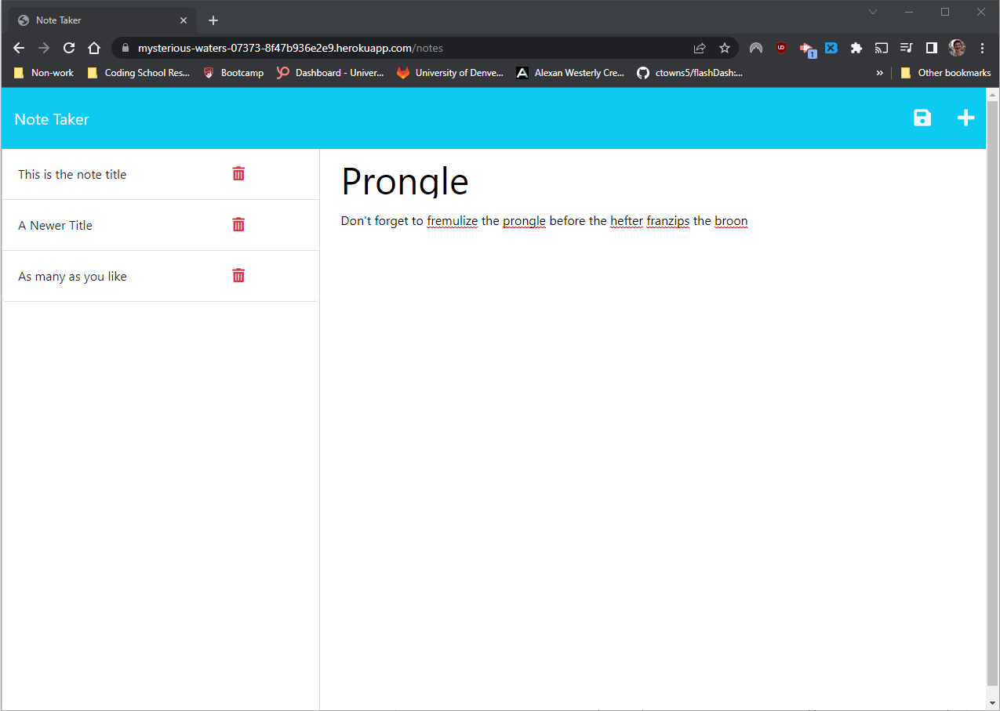

# Notes-Express

### Deployed at https://mysterious-waters-07373-8f47b936e2e9.herokuapp.com/

## Table of Contents

- [Description](#description)
- [Installation](#installation)
- [Questions](#questions)
- [License](#license)

## Description

This is a simple notes app that allows you to store and delete notes. It was made as an assignment as part of my full stack bootcamp program to demonstrate the functioning of express.js
The app is fully functioning. One can add as many notes as they like, and the delete button works as expected. Hopefully you find it useful!

## Installation

No need to install, simply run at the deployed Heroku page: https://mysterious-waters-07373-8f47b936e2e9.herokuapp.com/

## Questions

You can contact me with questions in the following places: 

Github Profile: https://github.com/TrueWillB 

## License

This repo and all of its contents operate under MIT License. For details, please view the LICENSE file in the repository or click the badge: 
